# Onboarding Architecture Flow

If you only keep one sentence in mind, use this:

`entry script -> orchestrator builds Pulse and structured decisions -> hard risk guards -> executor or local state applies them -> runtime-artifacts stores the trail -> web reads and displays it`

New contributors should start with the green path:

- `pnpm daily:pulse`
- `pnpm pulse:live`
- `AGENT_DECISION_STRATEGY=pulse-direct`

The mode-branch companion diagram still lives in [Order Mode Flowchart](./trading-modes-flowchart.en.md).

## System View

```mermaid
flowchart LR
  human[Human / Scheduler / CLI] --> daily[pnpm daily:pulse]
  human --> paper[pnpm trial:recommend / trial:approve]
  human --> stateless[pnpm pulse:live]
  human --> stateful[pnpm live:test]

  daily --> stateless

  paper --> paperCore[Load portfolio context]
  stateless --> preflight[Preflight]
  stateful --> infraPreflight[Preflight + DB/Redis/Queue]

  paperCore --> pulse[Pulse generation]
  preflight --> pulse
  infraPreflight --> pulse

  pulse --> strategy{Decision runtime}
  strategy -->|default| pulseDirect[pulse-direct runtime]
  strategy -->|legacy| providerRuntime[provider-runtime]

  pulseDirect --> guards[Risk guards]
  providerRuntime --> guards

  guards --> route{Execution path}
  route -->|paper| localState[Local paper state file]
  route -->|stateless| directExec[Direct Polymarket execution]
  route -->|stateful| queueExec[BullMQ queue + executor worker]

  queueExec --> db[(Postgres / Redis)]
  directExec --> artifacts[runtime-artifacts]
  localState --> artifacts
  db --> artifacts

  localState --> web[apps/web]
  db --> web
  artifacts --> web

  reports[review / monitor / rebalance / runtime-log] --> artifacts
  pulse --> reports
  pulseDirect --> reports
  providerRuntime --> reports

  roughLoop[services/rough-loop] -. separate loop .-> human

  classDef primary fill:#e8fff1,stroke:#147a3f,stroke-width:2px,color:#0d3b21;
  classDef legacy fill:#fff1f1,stroke:#b42318,stroke-width:2px,color:#5c1111;
  classDef stateful fill:#eef4ff,stroke:#175cd3,stroke-width:2px,color:#102a56;
  classDef storage fill:#fff8db,stroke:#b54708,stroke-width:2px,color:#5f370e;
  classDef auxiliary fill:#f4f3ff,stroke:#6e59cf,stroke-width:1px,color:#2f2473;

  class daily,stateless,preflight,pulse,pulseDirect,guards,directExec primary;
  class providerRuntime legacy;
  class stateful,infraPreflight,queueExec,db stateful;
  class localState,artifacts,reports storage;
  class roughLoop auxiliary;
```

How to read the diagram:

- Green: the default main path and the best onboarding route.
- Blue: the fuller `live:test` path with stronger infra coupling.
- Red: the legacy comparison path.
- Yellow: where state and artifacts finally land.

## The Three Run Modes

### 1. `paper`

- The entry is [`pnpm trial:recommend` / `pnpm trial:approve`](../services/orchestrator/package.json).
- It still reuses [`services/orchestrator/src/jobs/daily-pulse-core.ts`](../services/orchestrator/src/jobs/daily-pulse-core.ts).
- The difference is the landing point: decisions are written to `AUTOPOLY_LOCAL_STATE_FILE`, which defaults to `runtime-artifacts/local/paper-state.json`.
- The actual paper fills and portfolio mutation happen in [`services/orchestrator/src/ops/trial-approve.ts`](../services/orchestrator/src/ops/trial-approve.ts).

### 2. `pulse:live`

- The entry is [`scripts/pulse-live.ts`](../scripts/pulse-live.ts).
- It runs live preflight, fetches remote positions and collateral, and then generates or reuses Pulse.
- By default it uses [`services/orchestrator/src/runtime/pulse-direct-runtime.ts`](../services/orchestrator/src/runtime/pulse-direct-runtime.ts).
- After risk guards, it talks to the executor's Polymarket layer directly and does not require a local DB or Redis.
- This is the fastest real-money closed loop and the recommended onboarding path.

### 3. `live:test`

- The entry is [`scripts/live-test.ts`](../scripts/live-test.ts).
- It does the same high-level work as stateless, but also checks DB, Redis, and queue-worker readiness.
- Orchestrator persists the run to DB and hands executable trades to [`services/executor/src/workers/queue-worker.ts`](../services/executor/src/workers/queue-worker.ts) through BullMQ.
- It is closer to the production shape, but also more infra-sensitive.

One more clarification:

- [`scripts/daily-pulse.ts`](../scripts/daily-pulse.ts) is not a fourth mode.
- It is only a convenience wrapper around `pulse:live`, with defaults for `.env.pizza`, `AUTOPOLY_EXECUTION_MODE=live`, and `pulse-direct`.

## Module Map

| Module | What it owns | Start here |
| --- | --- | --- |
| [`scripts/`](../scripts) | Workspace CLI entrypoints that wire modes together | [`scripts/daily-pulse.ts`](../scripts/daily-pulse.ts), [`scripts/pulse-live.ts`](../scripts/pulse-live.ts), [`scripts/live-test.ts`](../scripts/live-test.ts) |
| [`services/orchestrator/`](../services/orchestrator) | research input, decision runtime, risk clipping, report artifacts | [`services/orchestrator/src/jobs/daily-pulse-core.ts`](../services/orchestrator/src/jobs/daily-pulse-core.ts), [`services/orchestrator/src/runtime/runtime-factory.ts`](../services/orchestrator/src/runtime/runtime-factory.ts) |
| [`services/executor/`](../services/executor) | Polymarket connectivity, order execution, sync, flatten, stop-loss | [`services/executor/src/workers/queue-worker.ts`](../services/executor/src/workers/queue-worker.ts), [`services/executor/src/lib/polymarket.ts`](../services/executor/src/lib/polymarket.ts) |
| [`packages/contracts/`](../packages/contracts) | shared schemas and data contracts across modules | [`packages/contracts/src/index.ts`](../packages/contracts/src/index.ts) |
| [`packages/db/`](../packages/db) | DB schema, query facade, and paper local-state fallback | [`packages/db/src/queries.ts`](../packages/db/src/queries.ts), [`packages/db/src/local-state.ts`](../packages/db/src/local-state.ts) |
| [`packages/terminal-ui/`](../packages/terminal-ui) | colored terminal output, summaries, and tables | [`packages/terminal-ui/src`](../packages/terminal-ui/src) |
| [`apps/web/`](../apps/web) | public read-only pages and admin console, not the main execution hot path | [`apps/web/lib/internal-api.ts`](../apps/web/lib/internal-api.ts), [`apps/web/app`](../apps/web/app) |
| [`runtime-artifacts/`](../runtime-artifacts) | the traceable archive of every important run output | `reports/`, `pulse-live/`, `live-test/`, `checkpoints/`, `local/` |
| [`services/rough-loop/`](../services/rough-loop) | independent coding loop, not part of the trading path | [`services/rough-loop/src/cli.ts`](../services/rough-loop/src/cli.ts) |

## Source Of Truth vs Runtime Archive

This is the easiest boundary for new contributors to confuse:

| Scenario | Real source of truth | What that means |
| --- | --- | --- |
| `paper` | `AUTOPOLY_LOCAL_STATE_FILE`, defaulting to `runtime-artifacts/local/paper-state.json` | recommendation lands in local state first, and `trial:approve` performs the actual paper mutation |
| `pulse:live` | remote wallet / Polymarket | local files are mainly archives, not an internal portfolio ledger |
| `live:test` | Postgres + Redis + queue worker | the system maintains runs, decisions, positions, execution events, snapshots, and system status internally |
| `runtime-artifacts/` | usually not a source of truth | it mostly stores checkpoints, reports, summaries, and errors for traceability |

One more note:

- [`apps/web`](../apps/web) does not always read from one fixed source.
- Depending on environment, it may read local state, Postgres, or a public wallet endpoint directly.

## Key Artifact Destinations

- `runtime-artifacts/reports/pulse/...`
  - research input for downstream decisions
- `runtime-artifacts/reports/review|monitor|rebalance/...`
  - human-readable portfolio reports
- `runtime-artifacts/reports/runtime-log/...`
  - explanatory runtime logs
- `runtime-artifacts/pulse-live/<run>/`
  - `preflight.json`, `recommendation.json`, `execution-summary.json`, `run-summary.md`
- `runtime-artifacts/live-test/<run>/`
  - preflight, recommendation, execution summary, or error artifacts for the stateful path
- `runtime-artifacts/checkpoints/trial-recommend/`
  - resumable checkpoints for the paper recommendation flow
- `runtime-artifacts/local/paper-state.json`
  - default paper state file; overridden by `AUTOPOLY_LOCAL_STATE_FILE` when provided

## Seven Things New Contributors Commonly Mix Up

- `daily:pulse` is not a separate engine; it wraps `pulse:live`.
- `Preflight` is a stage, not a mode.
- `pulse-direct` is the current default main path; `provider-runtime` still exists but is now mainly legacy/comparison.
- `apps/web` reads data and triggers admin actions; it does not sit in the main trading hot path, and its data source is not always the DB.
- `paper` and `live` reuse the same Pulse and decision core; the main difference is where execution lands and which state source is used.
- `runtime-artifacts` is not a unified state store; only a small subset is state, while most of it is archive/report output.
- `services/rough-loop` is a coding loop, not the trading daemon.

## Suggested Reading Order

1. Read this page first to understand module boundaries.
2. Read [Order Mode Flowchart](./trading-modes-flowchart.en.md) next for mode branching.
3. Follow the default path in code:
   `scripts/daily-pulse.ts -> scripts/pulse-live.ts -> services/orchestrator/src/jobs/daily-pulse-core.ts -> services/orchestrator/src/runtime/pulse-direct-runtime.ts`
4. Then compare the alternate entrypoints:
   [`scripts/live-test.ts`](../scripts/live-test.ts),
   [`services/orchestrator/src/ops/trial-recommend.ts`](../services/orchestrator/src/ops/trial-recommend.ts),
   [`services/orchestrator/src/ops/trial-approve.ts`](../services/orchestrator/src/ops/trial-approve.ts).
