# 新人 Onboarding 架构图

如果只用一句话解释这个仓库，可以这样理解：

`入口脚本 -> orchestrator 生成 Pulse 与结构化决策 -> 风控硬裁剪 -> executor / 本地状态执行 -> runtime-artifacts 归档 -> web 展示`

当前推荐新人先看绿色主路径：

- `pnpm daily:pulse`
- `pnpm live:test:stateless`
- `AGENT_DECISION_STRATEGY=pulse-direct`

配套模式分叉图见 [下单模式流程图](./trading-modes-flowchart.md)。

## 总图

```mermaid
flowchart LR
  human[Human / Scheduler / CLI] --> daily[pnpm daily:pulse]
  human --> paper[pnpm trial:recommend / trial:approve]
  human --> stateless[pnpm live:test:stateless]
  human --> stateful[pnpm live:test]

  daily --> stateless

  paper --> paperCore[Load portfolio context]
  stateless --> preflight[Preflight]
  stateful --> infraPreflight[Preflight + DB/Redis/Queue]

  paperCore --> pulse[Pulse generation]
  preflight --> pulse
  infraPreflight --> pulse

  pulse --> strategy{Decision runtime}
  strategy -->|default| pulseDirect[pulse-direct runtime]
  strategy -->|legacy| providerRuntime[provider-runtime]

  pulseDirect --> guards[Risk guards]
  providerRuntime --> guards

  guards --> route{Execution path}
  route -->|paper| localState[Local paper state file]
  route -->|stateless| directExec[Direct Polymarket execution]
  route -->|stateful| queueExec[BullMQ queue + executor worker]

  queueExec --> db[(Postgres / Redis)]
  directExec --> artifacts[runtime-artifacts]
  localState --> artifacts
  db --> artifacts

  localState --> web[apps/web]
  db --> web
  artifacts --> web

  reports[review / monitor / rebalance / runtime-log] --> artifacts
  pulse --> reports
  pulseDirect --> reports
  providerRuntime --> reports

  roughLoop[services/rough-loop] -. separate loop .-> human

  classDef primary fill:#e8fff1,stroke:#147a3f,stroke-width:2px,color:#0d3b21;
  classDef legacy fill:#fff1f1,stroke:#b42318,stroke-width:2px,color:#5c1111;
  classDef stateful fill:#eef4ff,stroke:#175cd3,stroke-width:2px,color:#102a56;
  classDef storage fill:#fff8db,stroke:#b54708,stroke-width:2px,color:#5f370e;
  classDef auxiliary fill:#f4f3ff,stroke:#6e59cf,stroke-width:1px,color:#2f2473;

  class daily,stateless,preflight,pulse,pulseDirect,guards,directExec primary;
  class providerRuntime legacy;
  class stateful,infraPreflight,queueExec,db stateful;
  class localState,artifacts,reports storage;
  class roughLoop auxiliary;
```

图怎么读：

- 绿色：当前默认主路径，也是新人最值得先读通的一条链。
- 蓝色：更接近生产的 `live:test`，但更依赖 DB / Redis / queue worker。
- 红色：`provider-runtime` 仍可用，但现在已经是 legacy 对照路径。
- 黄色：状态和归档的最终落点。

## 三条运行模式

### 1. `paper`

- 入口是 [`scripts` 上游的 `pnpm trial:recommend` / `pnpm trial:approve`](../services/orchestrator/package.json)。
- 研究和决策核心并没有换，仍然会走 [`services/orchestrator/src/jobs/daily-pulse-core.ts`](../services/orchestrator/src/jobs/daily-pulse-core.ts)。
- 差别在于结果不会直接下真钱单，而是先写入 `AUTOPOLY_LOCAL_STATE_FILE`，默认是 `runtime-artifacts/local/paper-state.json`。
- 真正改变 paper 仓位、成交和净值的是 [`services/orchestrator/src/ops/trial-approve.ts`](../services/orchestrator/src/ops/trial-approve.ts)。

### 2. `live:test:stateless`

- 入口是 [`scripts/live-test-stateless.ts`](../scripts/live-test-stateless.ts)。
- 这条链会先做 live preflight，然后拉远端仓位和 collateral，再生成或复用 Pulse。
- 决策默认走 [`services/orchestrator/src/runtime/pulse-direct-runtime.ts`](../services/orchestrator/src/runtime/pulse-direct-runtime.ts)。
- 过完风控后，直接调用 executor 的 Polymarket 接线层执行，不依赖本地 DB / Redis。
- 这是当前最快的真钱闭环，也是 onboarding 推荐主路径。

### 3. `live:test`

- 入口是 [`scripts/live-test.ts`](../scripts/live-test.ts)。
- 它和 stateless 一样会做 preflight，但还会额外检查 DB / Redis / queue worker。
- orchestrator 会把运行结果持久化到 DB，并通过 BullMQ 把可执行交易交给 [`services/executor/src/workers/queue-worker.ts`](../services/executor/src/workers/queue-worker.ts)。
- 更接近完整生产链路，但对基础设施更敏感。

补一句：

- [`scripts/daily-pulse.ts`](../scripts/daily-pulse.ts) 不是第四种模式。
- 它只是 `live:test:stateless` 的一层便捷包装，默认帮你补上 `.env.pizza`、`AUTOPOLY_EXECUTION_MODE=live` 和 `pulse-direct`。

## 模块地图

| 模块 | 负责什么 | 新人先看哪里 |
| --- | --- | --- |
| [`scripts/`](../scripts) | 工作区级 CLI 入口，把不同运行模式拼起来 | [`scripts/daily-pulse.ts`](../scripts/daily-pulse.ts)、[`scripts/live-test-stateless.ts`](../scripts/live-test-stateless.ts)、[`scripts/live-test.ts`](../scripts/live-test.ts) |
| [`services/orchestrator/`](../services/orchestrator) | 研究输入、决策运行时、风控裁剪、报告产物 | [`services/orchestrator/src/jobs/daily-pulse-core.ts`](../services/orchestrator/src/jobs/daily-pulse-core.ts)、[`services/orchestrator/src/runtime/runtime-factory.ts`](../services/orchestrator/src/runtime/runtime-factory.ts) |
| [`services/executor/`](../services/executor) | 对接 Polymarket，下单、同步、flatten、stop-loss | [`services/executor/src/workers/queue-worker.ts`](../services/executor/src/workers/queue-worker.ts)、[`services/executor/src/lib/polymarket.ts`](../services/executor/src/lib/polymarket.ts) |
| [`packages/contracts/`](../packages/contracts) | 共享 schema 和类型契约，避免各模块各说各话 | [`packages/contracts/src/index.ts`](../packages/contracts/src/index.ts) |
| [`packages/db/`](../packages/db) | DB schema、查询接口、paper local-state fallback | [`packages/db/src/queries.ts`](../packages/db/src/queries.ts)、[`packages/db/src/local-state.ts`](../packages/db/src/local-state.ts) |
| [`packages/terminal-ui/`](../packages/terminal-ui) | 终端彩色输出、错误摘要、表格 | [`packages/terminal-ui/src`](../packages/terminal-ui/src) |
| [`apps/web/`](../apps/web) | 公开展示和管理员控制台，不是主执行热路径 | [`apps/web/lib/internal-api.ts`](../apps/web/lib/internal-api.ts)、[`apps/web/app`](../apps/web/app) |
| [`runtime-artifacts/`](../runtime-artifacts) | 一切可追溯归档 | `reports/`、`live-stateless/`、`live-test/`、`checkpoints/`、`local/` |
| [`services/rough-loop/`](../services/rough-loop) | 独立的代码任务循环器，不是交易主链路 | [`services/rough-loop/src/cli.ts`](../services/rough-loop/src/cli.ts) |

## 真实状态源 vs 运行归档

这是新人最容易混掉的一组概念：

| 场景 | 真正的状态源 | 说明 |
| --- | --- | --- |
| `paper` | `AUTOPOLY_LOCAL_STATE_FILE`，默认 `runtime-artifacts/local/paper-state.json` | 推荐先写入本地 state，`trial:approve` 才真正改仓位和成交 |
| `live:test:stateless` | 远端钱包 / Polymarket | 本地主要写归档，不维护一套内部 DB 账本 |
| `live:test` | Postgres + Redis + queue worker | 内部会维护 run、decision、position、execution event、snapshot、system status |
| `runtime-artifacts/` | 大多不是状态源 | 它主要负责 checkpoint、report、summary、error 等追溯材料 |

补一句：

- [`apps/web`](../apps/web) 也不是固定只读一种数据源。
- 在不同环境下，它可能读本地 state、Postgres，或者直接读公开钱包接口。

## 关键归档落点

- `runtime-artifacts/reports/pulse/...`
  - 市场研究输入，后续决策都基于它。
- `runtime-artifacts/reports/review|monitor|rebalance/...`
  - 给人看的组合报告。
- `runtime-artifacts/reports/runtime-log/...`
  - 决策运行时的解释性日志。
- `runtime-artifacts/live-stateless/<run>/`
  - stateless live 运行的 `preflight.json`、`recommendation.json`、`execution-summary.json`、`run-summary.md`。
- `runtime-artifacts/live-test/<run>/`
  - stateful live 运行的 preflight、recommendation、execution summary 或 error。
- `runtime-artifacts/checkpoints/trial-recommend/`
  - paper 推荐流程的断点续跑检查点。
- `runtime-artifacts/local/paper-state.json`
  - paper 默认状态文件；如果设了 `AUTOPOLY_LOCAL_STATE_FILE`，则以显式路径为准。

## 新人最容易搞混的 7 件事

- `daily:pulse` 不是独立引擎，它底层就是 `live:test:stateless`。
- `Preflight` 不是模式，而是所有 live 路径的必经阶段。
- `pulse-direct` 是当前默认主路径，`provider-runtime` 还在，但主要是 legacy / 对照用途。
- `apps/web` 主要负责读数据和触发管理动作，不负责主交易执行，而且它的读源不一定总是 DB。
- `paper` 和 `live` 不是两套策略内核，它们复用同一套 Pulse 和 decision core，主要区别在执行落点和状态源。
- `runtime-artifacts` 不是统一状态库，只有少数文件是状态，大多数是归档和报告。
- `services/rough-loop` 是代码任务 loop，不是交易 daemon，不在主下单链路里。

## 推荐阅读顺序

1. 先看本文，知道“模块怎么接起来”。
2. 再看 [下单模式流程图](./trading-modes-flowchart.md)，补运行模式分叉。
3. 然后顺着代码读：
   `scripts/daily-pulse.ts -> scripts/live-test-stateless.ts -> services/orchestrator/src/jobs/daily-pulse-core.ts -> services/orchestrator/src/runtime/pulse-direct-runtime.ts`
4. 最后再看 `live:test` 和 `paper` 的差异入口：
   [`scripts/live-test.ts`](../scripts/live-test.ts)、
   [`services/orchestrator/src/ops/trial-recommend.ts`](../services/orchestrator/src/ops/trial-recommend.ts)、
   [`services/orchestrator/src/ops/trial-approve.ts`](../services/orchestrator/src/ops/trial-approve.ts)。
