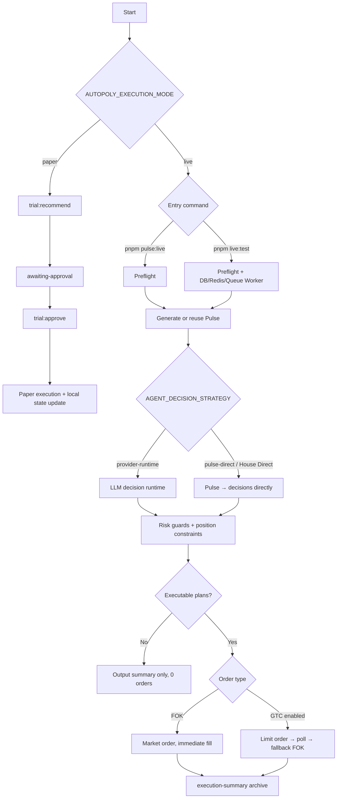
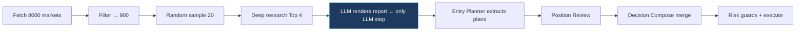

# Trading Modes Flowchart

## Pulse Live Internal Stages (pulse-direct strategy)

## Glossary

- `Pulse Live`: `pnpm pulse:live` (default live trading)
- `Pre-Flight`: Pre-trade validation stage (not a standalone mode)
- `House Direct`: `AGENT_DECISION_STRATEGY=pulse-direct`
- `GTC`: Good Till Cancelled limit orders (disabled by default, `ENABLE_GTC_ORDERS=true`)
- `FOK`: Fill or Kill market orders (current default)

## Detailed flow

→ See [`pulse-live-flow.en.md`](pulse-live-flow.en.md)
