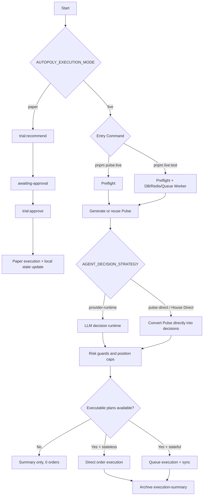

# Trading Modes Flowchart

## Term Mapping

- `Stateless`: `pnpm pulse:live`
- `Pre-Flight`: a gate stage inside live flow (not a standalone order mode)
- `House Direct`: `AGENT_DECISION_STRATEGY=pulse-direct`
