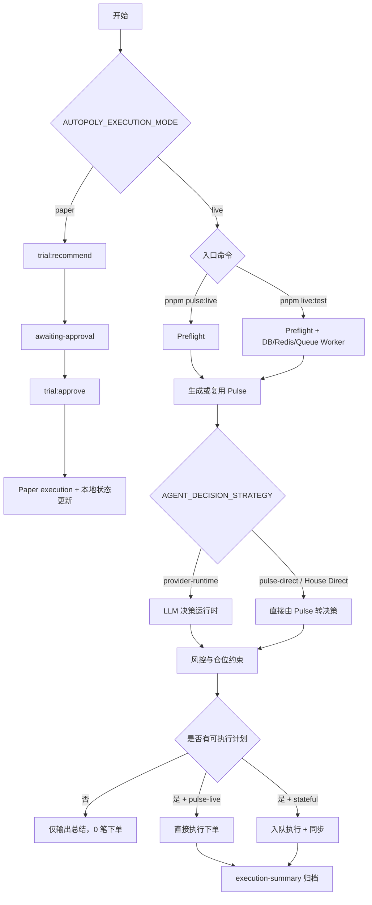

# 下单模式流程图

```mermaid
flowchart TD
  A[开始] --> B{AUTOPOLY_EXECUTION_MODE}

  B -->|paper| C[trial:recommend]
  C --> D[awaiting-approval]
  D --> E[trial:approve]
  E --> F[Paper execution + 本地状态更新]

  B -->|live| G{入口命令}
  G -->|pnpm pulse:live| H[Preflight]
  G -->|pnpm live:test| I[Preflight + DB/Redis/Queue Worker]

  H --> J[生成或复用 Pulse]
  I --> J

  J --> K{AGENT_DECISION_STRATEGY}
  K -->|provider-runtime| L[LLM 决策运行时]
  K -->|pulse-direct / House Direct| M[直接由 Pulse 转决策]

  L --> N[风控与仓位约束]
  M --> N

  N --> O{是否有可执行计划}
  O -->|否| P[仅输出总结，0 笔下单]
  O -->|是 + pulse-live| Q[直接执行下单]
  O -->|是 + stateful| R[入队执行 + 同步]

  Q --> S[execution-summary 归档]
  R --> S
```

## 名词对齐

- `Pulse Live`：`pnpm pulse:live`
- `Pre-Flight`：live 流程中的前置检查阶段（不是独立下单模式）
- `House Direct`：`AGENT_DECISION_STRATEGY=pulse-direct`
