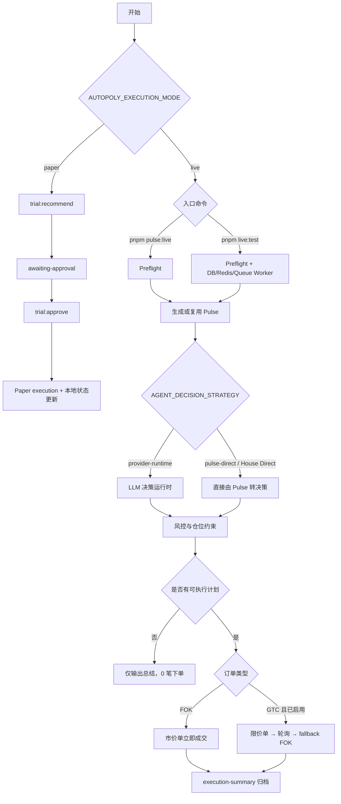
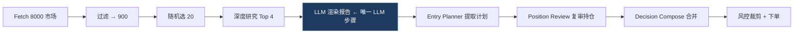

# 下单模式流程图

## Pulse Live 内部阶段（pulse-direct 策略）

## 名词对齐

- `Pulse Live`：`pnpm pulse:live`（默认实盘）
- `Pre-Flight`：live 流程中的前置检查阶段（不是独立下单模式）
- `House Direct`：`AGENT_DECISION_STRATEGY=pulse-direct`
- `GTC`：Good Till Cancelled 限价单（默认关闭，`ENABLE_GTC_ORDERS=true` 启用）
- `FOK`：Fill or Kill 市价单（当前默认）

## 详细流程文档

→ 见 [`pulse-live-flow.md`](pulse-live-flow.md)
