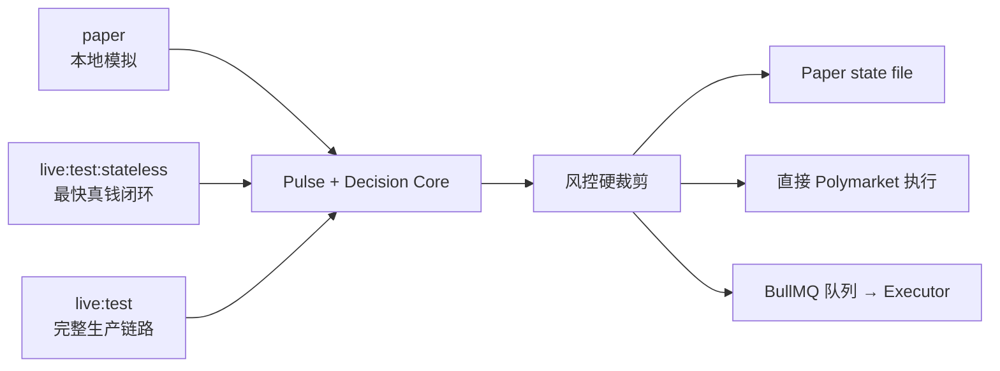

# Autonomous Poly Trading

> This README is written in Chinese for the maintainer's convenience. Don't worry — every document in this repository has a matching English version. See [README.en.md](README.en.md) for the full English README.

最后更新：2026-03-24

---

面向 [Polymarket](https://polymarket.com) 的云端自主交易系统。目标是做一套**可真实运行、可公开围观、具备服务层硬风控**的交易 Agent。

核心定位：

- 单真钱包实例，网站公开只读围观
- 风控不靠提示词，靠服务层硬规则
- Agent 在云端持续运行，而非本地脚本临时执行
- 第三方可在网页看到真实仓位、成交记录、净值曲线和运行报告

## 目录

- [架构总览](#架构总览)
- [Monorepo 结构](#monorepo-结构)
- [三条运行链路](#三条运行链路)
- [决策引擎](#决策引擎)
- [风控体系](#风控体系)
- [快速开始](#快速开始)
- [环境变量](#环境变量)
- [命令速查](#命令速查)
- [部署形态](#部署形态)
- [外部依赖仓库](#外部依赖仓库)
- [运行归档](#运行归档)
- [当前状态](#当前状态)
- [文档索引](#文档索引)

---

## 架构总览

系统分为四层，数据从上到下流动：

```
┌─────────────────────────────────────────────────────────────┐
│  Layer 1 · Research / Pulse                                 │
│  从 Polymarket 抓取市场列表，生成 Pulse 候选池              │
│  产物 → runtime-artifacts/reports/pulse/...                 │
└───────────────────────────┬─────────────────────────────────┘
                            ▼
┌─────────────────────────────────────────────────────────────┐
│  Layer 2 · Decision / Runtime                               │
│  orchestrator 将 Pulse + 持仓上下文 → 结构化决策            │
│  主路径: pulse-direct │ legacy: provider-runtime            │
└───────────────────────────┬─────────────────────────────────┘
                            ▼
┌─────────────────────────────────────────────────────────────┐
│  Layer 3 · Execution / Risk                                 │
│  服务层硬风控裁剪 → executor 下单 / 同步 / 止损 / flatten   │
│  FOK 市价单 · 单笔≤5% · 总敞口≤50% · 回撤≥20% halt        │
└───────────────────────────┬─────────────────────────────────┘
                            ▼
┌─────────────────────────────────────────────────────────────┐
│  Layer 4 · State / Archive / UI                             │
│  DB / 本地状态 / runtime-artifacts 归档 / apps/web 展示     │
└─────────────────────────────────────────────────────────────┘
```

Mermaid 版和更细的模块连接见 [Illustration/onboarding-architecture.md](Illustration/onboarding-architecture.md)。

## Monorepo 结构

本仓库是 `pnpm` monorepo（`pnpm@10.28.1`，Node ≥ 20），没有根级 `src/`，源码分布在以下子包中：

```
autonomous-poly-trading/
├── apps/
│   └── web/                          # Next.js 16 网站：公开围观 + 管理员控制台
├── services/
│   ├── orchestrator/                 # 调度、Pulse、决策运行时、风控、报告
│   ├── executor/                     # Polymarket CLOB 对接、下单、同步、队列 worker
│   └── rough-loop/                   # 独立的代码任务循环器（非交易主链路）
├── packages/
│   ├── contracts/                    # Zod schema：TradeDecisionSet 等共享契约
│   ├── db/                           # Drizzle schema、迁移、查询、local-state
│   └── terminal-ui/                  # 终端彩色输出、错误摘要、表格渲染
├── scripts/                          # 工作区级入口：daily-pulse、live-test、poly-cli
├── vendor/                           # 外部仓库锁定清单（manifest.json）
├── deploy/hostinger/                 # VPS 部署脚本与环境模板
├── Illustration/                     # 架构图、流程图、运维说明（中英双语）
├── Plan/                             # 阶段性规划文档
├── Wasted/                           # 已归档的 legacy handoff / 探索稿 / 历史进度
├── E2E Test Driven Development/      # Playwright + Vitest E2E 套件
├── runtime-artifacts/                # 运行产物归档（.gitignore，仅保留 .gitkeep）
├── docker-compose.yml                # 本地 Postgres 17 + Redis 8
├── docker-compose.hostinger.yml      # 生产向容器编排
└── package.json                      # 根 scripts + workspace 依赖
```

### 各模块职责速查

| 模块 | 做什么 | 关键入口 |
| --- | --- | --- |
| `apps/web` | 公开页面（总览/持仓/成交/runs/reports/backtests）+ 管理员操作 | `app/page.tsx` |
| `services/orchestrator` | Pulse 生成 → 决策运行时 → 风控裁剪 → 报告产物 | `src/jobs/daily-pulse-core.ts` |
| `services/executor` | Polymarket CLOB 下单、仓位同步、止损、flatten | `src/workers/queue-worker.ts`、`src/lib/polymarket.ts` |
| `packages/contracts` | `TradeDecisionSet`、`actionSchema`、队列/任务名等 | `src/index.ts` |
| `packages/db` | DB schema + 查询；paper 模式下的 file-backed local state | `src/queries.ts`、`src/local-state.ts` |
| `packages/terminal-ui` | 终端 UI 工具库 | `src/index.ts` |
| `scripts/` | CLI 入口，拼接不同运行模式 | `daily-pulse.ts`、`live-test-stateless.ts`、`live-test.ts` |
| `services/rough-loop` | 代码任务自动循环（不参与交易） | `src/cli.ts` |

## 三条运行链路



| 链路 | 命令 | 依赖 | 适合场景 |
| --- | --- | --- | --- |
| **paper** | `pnpm trial:recommend` / `trial:approve` | 本地文件 | 模拟与人工确认 |
| **live:test:stateless** | `pnpm live:test:stateless` | 钱包 + Polymarket | 最快真钱闭环，onboarding 首选 |
| **live:test** | `pnpm live:test` | 钱包 + DB + Redis + Queue | 完整生产链路 |

补充：`pnpm daily:pulse` 不是第四种链路，它是 `live:test:stateless` 的便捷包装，默认帮你配好 `.env.pizza`、`AUTOPOLY_EXECUTION_MODE=live` 和 `pulse-direct`。

### 执行流程

**所有 live 路径都必须经过 Preflight**——它不是独立模式，而是必经阶段。

**live:test:stateless**：

```
Preflight → 拉远端持仓/Collateral → Pulse 生成 → 决策运行时 → 风控 + Token Cap → 直接下单 → Summary 归档
```

**live:test**：

```
Preflight(+DB/Redis/Queue) → Pulse 生成 → Agent Cycle(决策+持久化) → 队列投递 → Executor Worker 执行 → Sync → Summary 归档
```

**paper**：

```
加载组合上下文 → Pulse 生成 → 决策运行时 → 共享 buildExecutionPlan（与 live:test:stateless 相同的风控 + 交易所门槛规则）→ awaiting-approval → trial:approve → Paper State 更新
```

## Provider 切换（Framework-Free 架构）

系统支持**任意 AI Agent** 作为 Pulse 渲染器。所有 provider 走统一的模板命令路径，不绑定特定框架或模型。

切换方式：只需在 `.env` 中修改一行：

```bash
# 使用 Codex
AGENT_RUNTIME_PROVIDER=codex

# 使用 Claude Code
AGENT_RUNTIME_PROVIDER=claude-code

# 使用 OpenClaw
AGENT_RUNTIME_PROVIDER=openclaw

# 使用自定义 Agent（需配 <NAME>_COMMAND 环境变量）
AGENT_RUNTIME_PROVIDER=my-agent
MY_AGENT_COMMAND='cat {{prompt_file}} | my-agent --output {{output_file}}'
```

任意模型在读取本项目后，都能根据自身框架自主切换 provider 并修改对应的环境变量。系统会自动使用该 provider 的默认命令模板，或读取 `<PROVIDER>_COMMAND` 自定义命令。

已内置默认命令的 provider：`codex`、`claude-code`、`openclaw`。

## 决策引擎

当前有两种决策策略，由 `AGENT_DECISION_STRATEGY` 环境变量控制：

### pulse-direct（当前默认主路径）

```
Pulse markdown → 正则/表格解析 → PulseEntryPlan
                                        ↓
当前持仓 → reviewCurrentPositions → hold/reduce/close
                                        ↓
           monthlyReturn 排序（top 4）→ 20% batch cap
                                        ↓
                   composePulseDirectDecisions → TradeDecisionSet
```

不依赖外部 LLM 进程，直接从 Pulse 结构化章节提取开仓候选，按 `monthlyReturn = edge / monthsToResolution` 排序，取 top 4，单轮总下注不超过 bankroll 的 20%。

### provider-runtime（legacy 对照）

通过 spawn 外部进程（Codex / OpenClaw / Claude Code CLI），把 Pulse + 持仓上下文传给 LLM，解析 stdout 得到 `TradeDecisionSet`。仍可用，但不再是默认路径。

## 风控体系

风控是服务层硬规则，无论上游用哪种 provider 或策略，进入 orchestrator / executor 链路后都受约束。

### 系统级

| 规则 | 阈值 | 效果 |
| --- | --- | --- |
| 组合回撤 halt | 净值相对高水位回撤 ≥ **30%** | 进入 `halted`，禁止新开仓 |
| 恢复 | 仅管理员 `resume` | fail-closed 设计 |

### 仓位级

| 规则 | 阈值 |
| --- | --- |
| 单仓止损 | 浮亏 ≥ **30%** |
| 止损优先级 | 高于常规策略动作 |

### 执行级

| 规则 | 默认值 |
| --- | --- |
| 下单类型 | **FOK** 市价单 |
| 单笔上限 | 资金的 **15%** |
| 最大总敞口 | 资金的 **80%** |
| 单事件敞口上限 | 资金的 **30%** |
| 最大并发持仓 | **22** 个 |
| 最小交易额 | **$5** |
| 最小有效额度 | 低于此直接丢弃 |

### Pulse 级

- 必须来自真实 `fetch_markets.py` 抓取，不再有 mock fallback
- Pulse 超龄（>120 分钟）或候选不足（<1 个）视为风险状态，本轮禁止新 `open`
- CLOB token ID 风险标志已移除（坏候选在生成阶段已被过滤）
- `open` 的 `token_id` 必须来自 Pulse candidates

完整规则见 [risk-controls.md](risk-controls.md)。

## 快速开始

### 最小 Build（验证构建）

```bash
git clone https://github.com/Alchemist-X/autonomous-poly-trading.git
cd autonomous-poly-trading
pnpm install
pnpm build
```

不需要 Docker、Codex CLI 或真钱包凭据——只验证 TS / Next.js 能否编译通过。

### 跑 Pulse 和 Recommendation

```bash
cp .env.example .env
pnpm vendor:sync
# 补齐 CODEX_COMMAND / 钱包凭据
pnpm daily:pulse              # 便捷入口
# 或者
pnpm live:test:stateless -- --recommend-only   # 只看建议不下单
```

### 完整本地栈（Stateful）

```bash
cp .env.example .env
pnpm install
pnpm vendor:sync
docker compose up -d postgres redis
pnpm db:migrate
pnpm db:seed
pnpm dev
```

默认端口：Web `3000` / Orchestrator `4001` / Executor `4002`

### Paper 模式

```bash
AUTOPOLY_EXECUTION_MODE=paper pnpm trial:recommend
AUTOPOLY_EXECUTION_MODE=paper pnpm trial:approve -- --latest
```

状态默认写入 `runtime-artifacts/local/paper-state.json`。
`trial:recommend` 现在会和 `live:test:stateless` 共用同一套执行前规则：同样读取 order book，应用同样的风险裁剪、最小交易额和 Polymarket 最小可执行门槛；差别只在最后不直接发真钱单，而是先进入 `awaiting-approval`。

## 环境变量

完整模板：[.env.example](.env.example)

分四组理解：

| 组 | 关键变量 | 说明 |
| --- | --- | --- |
| **共享** | `AUTOPOLY_EXECUTION_MODE` `DATABASE_URL` `REDIS_URL` `AUTOPOLY_LOCAL_STATE_FILE` | 执行模式（paper/live）、基础设施连接 |
| **Web** | `ADMIN_PASSWORD` `ORCHESTRATOR_INTERNAL_TOKEN` | 管理员鉴权 |
| **Executor** | `PRIVATE_KEY` `FUNDER_ADDRESS` `SIGNATURE_TYPE` `CHAIN_ID` | Polymarket 钱包与链配置 |
| **Orchestrator** | `AGENT_RUNTIME_PROVIDER` `AGENT_DECISION_STRATEGY` `PULSE_*` `CODEX_*` | Provider 选择、Pulse 抓取、风控参数 |

如果 Polymarket 凭据放在相邻仓库，可以设 `ENV_FILE=../pm-PlaceOrder/.env.aizen`。真实资金测试建议固定使用独立的 `.env.live-test`。

## 命令速查

### 构建与校验

```bash
pnpm build              # 全量构建
pnpm typecheck          # 全量类型检查
pnpm test               # Vitest 单测
```

### 数据库

```bash
pnpm db:generate        # 生成迁移
pnpm db:migrate         # 执行迁移
pnpm db:seed            # 种子数据
```

### 交易链路

```bash
# Paper
AUTOPOLY_EXECUTION_MODE=paper pnpm trial:recommend
AUTOPOLY_EXECUTION_MODE=paper pnpm trial:approve -- --latest

# Live Stateless
ENV_FILE=.env.live-test pnpm live:test:stateless
ENV_FILE=.env.live-test pnpm live:test:stateless -- --recommend-only
ENV_FILE=.env.live-test pnpm live:test:stateless -- --json

# Live Stateful
ENV_FILE=.env.live-test pnpm live:test

# Daily Pulse（stateless 的便捷入口）
pnpm daily:pulse
```

### Executor Ops

```bash
pnpm --filter @autopoly/executor ops:check
pnpm --filter @autopoly/executor ops:check -- --slug <market-slug>
pnpm --filter @autopoly/executor ops:trade -- --slug <market-slug> --max-usd 1
```

### E2E

```bash
pnpm e2e:install-browsers
pnpm e2e:local-lite
AUTOPOLY_E2E_REMOTE=1 pnpm e2e:remote-real
```

### Rough Loop

```bash
pnpm rough-loop:doctor
pnpm rough-loop:once
pnpm rough-loop:start
```

### Vendor

```bash
pnpm vendor:sync        # 同步外部仓库到 vendor/repos/
```

## 部署形态

| 组件 | 推荐部署方式 |
| --- | --- |
| `apps/web` | Vercel（只读 Postgres 凭据） |
| `services/orchestrator` | 单台云主机 |
| `services/executor` | 同一台云主机 |
| Postgres 17 | 托管数据库 |
| Redis 8 | 同机或托管 |

Hostinger VPS 部署方案见 [Illustration/hostinger-vps-deploy-runbook.md](Illustration/hostinger-vps-deploy-runbook.md)，配合 `docker-compose.hostinger.yml` 和 `deploy/hostinger/stack.env.example`。

管理员操作通过站内受保护接口调 orchestrator，不向公众暴露 4001/4002/5432/6379。

## 外部依赖仓库

`vendor/manifest.json` 锁定了以下外部仓库的具体 commit：

| 仓库 | 用途 |
| --- | --- |
| `polymarket-trading-TUI` | 交易终端和 CLOB 接线参考 |
| `polymarket-market-pulse` | Pulse 研究输入 |
| `alert-stop-loss-pm` | 止损逻辑参考 |
| `all-polymarket-skill` | Backtesting、Monitor、Resolution 等 skill 参考 |
| `pm-PlaceOrder` | 下单参考和本地凭据源 |

运行 `pnpm vendor:sync` 把它们同步到 `vendor/repos/`。纯 `pnpm build` 不需要 vendor，但跑 pulse / trial / live 链路前必须先 sync。

## 运行归档

所有运行产物写入 `runtime-artifacts/`（已 `.gitignore`），由 `ARTIFACT_STORAGE_ROOT` 控制根目录。

| 路径 | 内容 |
| --- | --- |
| `reports/pulse/YYYY/MM/DD/` | Pulse markdown + JSON（命名规范：`pulse-<timestamp>-<runtime>-<mode>-<runId>` ） |
| `reports/review\|monitor\|rebalance/` | 组合报告 |
| `reports/runtime-log/` | 决策运行时解释性日志 |
| `live-stateless/<timestamp>-<runId>/` | Stateless 运行：preflight、recommendation、execution-summary、run-summary |
| `live-test/<timestamp>-<runId>/` | Stateful 运行：同上 + error.json（失败时） |
| `checkpoints/trial-recommend/` | Paper 推荐断点续跑检查点 |
| `local/paper-state.json` | Paper 默认状态文件 |
| `rough-loop/` | Rough Loop 任务产物 |

失败归档（按 AGENTS 约定）写入 `run-error/`，包含失败阶段、核心上下文、原因摘要和下一步命令。

## 当前状态

截至 2026-03-24。

### 子系统完成度

| 子系统 | 状态 | 说明 |
| --- | --- | --- |
| Monorepo 构建 | ✅ 已完成 | `build` / `typecheck` / `test` 基础工作区支持 |
| Web 围观页 + 管理页 | ✅ 已完成 | 首页、持仓、成交、Runs、Reports、Backtests、Admin |
| 共享契约 / DB / Terminal UI | ✅ 已完成 | Schema、查询、local state、终端渲染 |
| Paper 本地测试盘 | ✅ 已完成 | 推荐 → 人工确认 → file-backed state |
| `live:test:stateless` | ✅ 已完成并持续运行 | 37 次 live-stateless 运行归档（03/16–03/24） |
| `live:test` stateful | ⚠️ 已实现但受阻 | 代码可用，本机缺 DB/Redis 导致 preflight 始终失败 |
| Pulse 真实抓取 | ✅ 已完成 | 累计产出约 50+ 份 Pulse 报告（03/14–03/23） |
| `pulse-direct` 决策引擎 | ✅ 已上线 | 03/20 起成为默认主路径，取代 provider-runtime |
| 双语运行总结 | ✅ 已完成 | Live 路径每轮生成中英 summary |
| Review / Monitor / Rebalance 报告 | ✅ 已完成 | 03/20 起随 daily pulse / live 运行自动写入 artifact |
| 风控硬规则 | ✅ 已完成 | `applyTradeGuards` + halt + stop-loss |
| Polymarket proxy wallet 兼容 | ✅ 已完成 | `FUNDER_ADDRESS` / `SIGNATURE_TYPE` |
| Resolution tracking | ✅ 已实现 | 独立周期能力，有真实产物 |
| Backtest | ⚠️ 轻量版 | 已接入 artifact 层，非生产级评估 |
| OpenClaw provider | 🔲 预留 | 接口存在，非当前默认 |
| Rough Loop | ✅ 独立子系统 | 03/17 完成 5 轮自动代码任务运行 |
| VPS 部署 | ✅ 已文档化 | Hostinger 部署 runbook + Docker compose |
| CI/CD | 🔲 待建设 | 暂无 GitHub Actions |

### 实际运行数据

**活跃钱包：Pizza**（`0x6664***614e`），collateral 约 $96.95 USDC。

**当前链上持仓（pizza wallet，2026-03-23 最后快照）**：

| 市场 | 方向 | 持仓量 | 均价 | 现价 | 浮盈/亏 |
| --- | --- | --- | --- | --- | --- |
| Bitcoin dip to 65k in March 2026 | BUY No | 1.34 | $0.746 | $0.742 | -0.5% |
| Gavin Newsom 2028 Dem nomination | BUY No | 1.32 | $0.758 | $0.758 | 0% |
| Gavin Newsom 2028 presidential election | BUY No | 1.21 | $0.825 | $0.835 | +1.2% |

**Paper 状态**：$200 bankroll / $176 现金 / 2 个模拟持仓（Vance + Avalanche），上次运行 03/16。

### 运行时间线

| 日期 | 事件 |
| --- | --- |
| **03/14** | 首批 Pulse 报告生成（codex provider-runtime），15 份 pulse；首次真实 $1 测试单成交 |
| **03/16** | Paper 模式打通完整闭环（recommend → approve → state update）；首批 live-stateless 运行；Pizza 钱包连通验证 |
| **03/17** | 大量 live-stateless 运行；no1 钱包快照显示 12 个真实持仓 / $128 总权益；Rough Loop 完成 5 轮代码任务 |
| **03/18** | Portfolio review 报告首次独立生成；live-stateless preflight 待处理 |
| **03/20** | **pulse-direct 引擎上线**，取代 provider-runtime 成为默认；review / monitor / rebalance 三类报告随运行自动生成；一笔原油市场订单被 Polymarket 拒单（$0.34） |
| **03/23** | 密集运行日——8 次 live-stateless 运行（pizza wallet）；live:test 尝试失败（DATABASE_URL 未配置）；VPS SSH 连通性复盘；最后一次完整运行产物时间 15:05 UTC |
| **03/24** | 一个 pending preflight 存在，但未完成完整运行 |

### 已发现的问题与阻塞

| 问题 | 影响 | 状态 |
| --- | --- | --- |
| 本机无 Postgres / Redis | `live:test` stateful 链路始终 preflight 失败 | 需要 Docker 或远端 DB |
| Pulse provider 超时 | 部分运行退化为 deterministic fallback，开仓候选质量降低 | 间歇性 |
| 最小交易额拦截 | 风控 `$10` 最小额度拦截了 stateless 的小额开仓候选 | 设计如此，stateless 路径已调低到 `$0.01` |
| 订单被 Polymarket 拒绝 | 原油市场一笔 $0.34 订单被拒 | 已归档，未影响后续运行 |

### 当前限制

- `live:test` stateful 链路在本机无法验证，需要远端基础设施
- 完整生产部署流程尚未收敛为单独 deploy handbook
- `provider-runtime` 作为 legacy 路径将继续弱化
- Backtest 仍是轻量版
- 无 CI/CD 流水线
- 无自动对账和告警通知

## 依赖矩阵

| 依赖 | 是否必需 | 用途 |
| --- | --- | --- |
| Node.js ≥ 20 | ✅ 必需 | Monorepo 构建与运行 |
| pnpm 10.x | ✅ 必需 | Workspace 包管理（当前 `10.28.1`） |
| TypeScript 5.9.x | 已内置 | TS 编译 |
| Docker / docker compose | 可选 | 本地 Postgres + Redis |
| Postgres 17 | 可选 | `live:test` 需要 |
| Redis 8 | 可选 | `live:test` 需要 |
| Codex CLI | 运行时按需 | `provider-runtime` / Pulse 生成 |
| Polymarket 钱包凭据 | live 路径必需 | 真钱下单 |

### 核心运行时依赖

| 包 | 主要依赖 |
| --- | --- |
| `apps/web` | Next.js 16、React 19 |
| `services/orchestrator` | Fastify 5、BullMQ 5、ioredis 5、drizzle-orm、node-cron |
| `services/executor` | @polymarket/clob-client 5、ethers 5、Fastify 5、BullMQ 5 |
| `packages/db` | postgres、drizzle-orm、drizzle-kit |
| `packages/contracts` | zod 4 |

## 文档索引

### 根目录

| 文档 | 内容 |
| --- | --- |
| [risk-controls.md](risk-controls.md) | 风控硬规则完整说明 |
| [.env.example](.env.example) | 环境变量模板 |
| [progress.md](progress.md) | 实现进度 |
| [todo-loop.md](todo-loop.md) | 后续高优先级事项 |
| [rough-loop.md](rough-loop.md) | Rough Loop 主入口文档 |
| [AGENTS.md](AGENTS.md) | 项目协作约定 |

说明：历史 handoff、探索稿和一次性进度记录已统一移到 [Wasted/README.md](Wasted/README.md)，避免继续散落在根目录。

### Illustration/

| 文档 | 内容 |
| --- | --- |
| [onboarding-architecture.md](Illustration/onboarding-architecture.md) | 新人架构图 + 模块地图 + 状态源说明 |
| [trading-modes-flowchart.md](Illustration/trading-modes-flowchart.md) | 下单模式流程图 |
| [portfolio-ops-report-design.md](Illustration/portfolio-ops-report-design.md) | Monitor / Review / Rebalance 报告设计 |
| [hostinger-vps-deploy-runbook.md](Illustration/hostinger-vps-deploy-runbook.md) | Hostinger VPS 部署 runbook |
| [repo-slimming-plan.md](Illustration/repo-slimming-plan.md) | 模块取舍 checklist |

### Plan/

| 文档 | 内容 |
| --- | --- |
| [2026-03-17-rough-loop-8h-run-plan.md](Plan/2026-03-17-rough-loop-8h-run-plan.md) | Rough Loop 8 小时持续运行方案 |
| [2026-03-17-position-review-module-plan.md](Plan/2026-03-17-position-review-module-plan.md) | Position Review 模块设计 |

### Wasted/

| 文档 | 内容 |
| --- | --- |
| [README.md](Wasted/README.md) | 已归档 legacy 文档与历史杂项的说明 |

## 新人接手路径

如果你是第一次接手这个仓库：

1. **读本文档**——理解四层架构和三条链路
2. **看 [.env.example](.env.example)**——了解运行模式和依赖
3. **看 [risk-controls.md](risk-controls.md)**——了解硬风控
4. **看 [Illustration/onboarding-architecture.md](Illustration/onboarding-architecture.md)**——理解模块边界、状态源和默认主路径
5. **看 [Illustration/trading-modes-flowchart.md](Illustration/trading-modes-flowchart.md)**——理解执行路径分叉
6. **跑 `pnpm build`**——验证构建
7. **跑 `pnpm daily:pulse` 或 `pnpm live:test:stateless -- --recommend-only`**——看一次完整决策输出

如果只是「先把项目 build 起来」，到第 6 步就够了。
