<p align="center">
  
</p>

<h1 align="center">Hourglass</h1>

<p align="center">
  <strong>链上信号驱动的预测市场交易 Agent</strong><br/>
  <sub>AVE Claw Hackathon 2026 参赛作品</sub>
</p>

<p align="center">
  <a href="https://hourglass-eta.vercel.app">在线 Demo</a> ·
  <a href="https://github.com/Alchemist-X/hourglass">GitHub 仓库</a> ·
  <a href="https://polymarket.com/profile/0xc78873644e582cb950f1af880c4f3ef3c11f2936">Polymarket 账号</a>
</p>

---

## 项目简介

Hourglass 是一个自主预测市场交易 Agent，利用 AVE Claw 的链上数据 Skill 在 Polymarket 预测市场上发现信息优势（Edge）。

**核心洞察：** 链上数据是预测市场的先行指标。鲸鱼的买卖行为、实时价格趋势、链上交易异常——这些信号比新闻更早、更真实。Hourglass 7×24 自动监控这些信号，在赔率失调时自动执行交易。

**关键成绩：**

- 4 个 AVE Claw Skill 深度集成
- 扫描 100+ 活跃 Polymarket 市场，跟踪 80+ 目标市场
- 覆盖 130+ 条链（通过 AVE Claw）
- 3 笔真实 Polymarket 实盘交易（链上可验证）
- 在线展示页 + 终端 Demo + 完整源码

---

## AVE Claw Skill 使用说明

本项目深度集成 AVE Claw v2 API（`https://prod.ave-api.com/v2`），使用 4 个核心 Skill：

### Skill 1 · 实时价格监控

- **AVE API:** `POST /v2/tokens/price`（批量最多 200 个 token）
- **用途:** 获取 BTC/ETH/WBTC 实时价格
- **实现文件:** `services/ave-monitor/src/client.ts` → `getTokenPrices()`
- **Hourglass 中的作用:** 提供预测市场分析的基础锚点（当前价 vs 目标价距离）

### Skill 2 · K 线技术分析

- **AVE API:** `GET /v2/klines/token/{token-id}?interval=N&limit=N`
- **用途:** 获取多周期 OHLCV 数据（13 种时间间隔：1m / 5m / 15m / 1h / 4h / 1d / 1w / 1mo 等）
- **实现文件:** `services/orchestrator/src/pulse/ave-crypto-signals.ts`
- **Hourglass 中的作用:** 计算 MA20/MA50、MACD 金叉/死叉、波动率 → 生成 `trendScore` (-1 ~ +1)

### Skill 3 · 鲸鱼行为追踪

- **AVE API:** `GET /v2/txs/{pair-id}?limit=N`
- **用途:** 监控交易对大额交易（>$100K）
- **实现文件:** `services/orchestrator/src/pulse/ave-crypto-signals.ts`
- **Hourglass 中的作用:** 计算 1 小时净买入/净卖出，检测机构积累/派发 → 生成 `whalePressure` (-1 ~ +1)

### Skill 4 · 链上买卖比

- **AVE API:** `GET /v2/tokens/{token-id}`
- **用途:** 获取 5 分钟/1 小时/6 小时/24 小时的买卖交易计数
- **实现文件:** `services/orchestrator/src/pulse/ave-crypto-signals.ts`
- **Hourglass 中的作用:** 加权聚合多时间窗口情绪（5m × 0.3 + 1h × 0.4 + 6h × 0.3）→ 生成 `sentimentScore` (-1 ~ +1)

### 信号聚合公式

```
overallScore = trendScore × 0.4 + whalePressure × 0.3 + sentimentScore × 0.3
```

综合得分输入到概率估算模型（`services/orchestrator/src/pulse/ave-signal-to-probability.ts`），转换为我们对 Polymarket 市场的概率估计。

---

## 四层架构

```
┌──────────────────────────────────────────────────────┐
│ Layer 1: AVE Claw 监控                                │
│ 实时价格 | K 线 | 鲸鱼 | 买卖比                         │
│ 130+ 条链 · 10+ 信息源 · 80+ 市场追踪                  │
└──────────────────────┬───────────────────────────────┘
                       ▼
┌──────────────────────────────────────────────────────┐
│ Layer 2: AI 决策引擎                                   │
│ 信号聚合 → 概率估算 → Edge 计算 → Kelly 仓位           │
└──────────────────────┬───────────────────────────────┘
                       ▼
┌──────────────────────────────────────────────────────┐
│ Layer 3: Polymarket 执行 + 6 层硬风控                 │
│ FOK 订单 | 免 Gas 签名 | 单笔 ≤15% | 回撤 30% 停机     │
└──────────────────────┬───────────────────────────────┘
                       ▼
┌──────────────────────────────────────────────────────┐
│ Layer 4: 展示 + 归档                                  │
│ 在线 Dashboard · 终端 Demo · 运行报告归档             │
└──────────────────────────────────────────────────────┘
```

---

## 展示页面内容（7 个 Section）

在线展示：**https://hourglass-eta.vercel.app**

### 1. Hero

沙漏品牌区 + 3 个火柴人插画说明 Agent 优势：

- 推理能力趋近人类
- 7×24 覆盖数千市场
- 秒级响应 vs 分钟级延迟

### 2. 问题与方案

普通交易者 vs Hourglass Agent 对比。用户证言："之前我要盯 20 个 Telegram 群才能捕捉鲸鱼动向。现在 Hourglass 自动帮我追踪 130+ 条链。"

### 3. 发现最有利可图的市场（Boss Encounter）

市场遭遇卡——显示当前重点分析的市场问题、交易量、赔率、结算日期。

### 4. 监控市场（实时 Polymarket 扫描）

实时从 Polymarket Gamma API 拉取数据：

- 扫描 100+ 活跃市场
- 过滤不现实目标（>1.5x 或 <0.6x 当前价）
- 优先每日价格区间市场（"BTC 在 $X-$Y 之间 on YYYY-MM-DD"）
- 每张卡牌显示：BTC/ETH 徽章、市场问题、交易量、赔率、我们的概率、净 Edge、BUY/SKIP 决定
- 非对称视觉：BUY 卡金绿大字 / SKIP 卡灰淡化
- 每张卡牌可点击跳转 Polymarket 核对原始数据
- **Edge 已扣除 Polymarket 2% 手续费**

### 5. AVE Claw API 原始响应

实时调用 v2 API 并展示：

- `GET /v2/supported_chains` → 返回 187 条链支持
- `POST /v2/tokens/price` → 返回 BTC/ETH 实时价格（JSON 片段）
- `GET /v2/klines/token/{btc-id}` → 返回 K 线数据
- 每个调用显示：HTTP 方法、URL、状态码、耗时、响应 JSON 片段
- API 失败时显示红色错误状态（不静默隐藏）

### 6. 4 Skill 卡牌分析

Slay the Spire 风格卡牌，展示 4 个 AVE Skill 的独立分析结果：

- 能量球（得分）+ 金属边框 + 签名条
- 每张卡显示：数据点、迷你可视化、-1~+1 信号条

### 7. 信号聚合 + Edge 计算

可视化信号权重融合：

- 圆环对比：我们的概率 vs 市场赔率
- 超大 Edge 数字
- AI 推理总结（羊皮纸背景）

### 8. 重点市场分析

最高 Edge 市场的 6 步 AI 推理：

1. BTC 当前价 vs 目标价距离
2. K 线趋势 + MACD 信号
3. 鲸鱼行为（净买入/卖出）
4. 买卖比多时间窗
5. 综合得分 → 概率估算
6. 市场赔率 → 净 Edge

附结论 + 下单建议。

### 9. Auto-Research

持续运行的 Agent 自主调参展示（动画无限循环插画）。

### 10. 交易执行 + 风控

卡牌展示实际下单详情 + 6 层风控检查全部通过。

### 11. 真实交易记录 + 思考时间轴

真实 Polymarket 持仓：

- 钱包 `0xc788...2936` 的 2 个活跃仓位
- 3 笔链上可验证的交易
- 6 步思考过程时间轴（总耗时 2.1 秒）

### 12. 技术架构

四层架构图 + 技术栈（TypeScript 5.9 · Next.js 16 · Fastify 5 · BullMQ 5 · Drizzle）。

---

## 技术栈

| 分类 | 技术 |
|------|------|
| 运行时 | Node.js 22+ |
| 语言 | TypeScript 5.9 |
| Monorepo | pnpm 10.x |
| 前端 | Next.js 16 + React 19 |
| 后端 | Fastify 5 |
| 队列 | BullMQ 5 |
| ORM | Drizzle |
| 校验 | Zod 4 |
| 测试 | Vitest + Playwright |
| 部署 | Vercel + Polygon 主网 |

---

## 本地运行

### 第一步 · 克隆代码

把项目拉到本地，进入项目目录。

```bash
git clone https://github.com/Alchemist-X/hourglass.git
cd hourglass
```

### 第二步 · 安装依赖

本项目使用 pnpm workspace，请确保已安装 Node 22+ 和 pnpm 10.x。

```bash
pnpm install
```

示例输出：
```
Scope: all 6 workspace projects
Lockfile is up to date, resolution step is skipped
Packages: +1283
...
Done in 45.2s
```

### 第三步 · 构建全部子包

一次性编译所有 workspace 包（contracts、db、ave-monitor、orchestrator、executor、web）。

```bash
pnpm build
```

构建成功后会看到 6 个 `Build complete` 信息。

### 第四步 · 运行 Demo（推荐先跑这个）

Demo 脚本会实时扫描 Polymarket 市场 + 调用 AVE API，展示完整推理管线，**不会下单**。

```bash
pnpm ave:demo
```

你会看到 6 步管线输出：扫描市场 → AVE 信号采集 → 信号聚合 → Edge 计算 → 风控检查 → 执行建议。

### 第五步 · 启动网页 Dashboard

本地预览在线展示页面。

```bash
pnpm --filter @autopoly/web dev
```

然后浏览器打开 `http://localhost:3000`。

### 第六步 · 实盘交易（可选，需真金白银）

**⚠️ 这一步会用真钱下单。** 请先按下一节配置 `.env.live`，确认钱包有 USDC，再执行：

```bash
# 仅扫描并推荐，不下单（安全预演）
ENV_FILE=.env.live pnpm ave:recommend

# 真实下单
ENV_FILE=.env.live pnpm ave:live
```

---

### 环境变量配置

复制模板然后按注释填入你自己的值。

```bash
cp .env.example .env.live
```

编辑 `.env.live`：

```bash
AUTOPOLY_EXECUTION_MODE=live
PRIVATE_KEY=0x....             # 你的 Polymarket 钱包私钥（Gnosis Safe 签名者）
FUNDER_ADDRESS=0x...           # 你的 Funder 地址（持有 USDC 的代理钱包）
SIGNATURE_TYPE=2               # 2 = Gnosis Safe 免 Gas 模式（推荐）
CHAIN_ID=137                   # Polygon 主网
AVE_API_KEY=xxxxx              # 从 sephana@ave.ai 申请的 v2 API Key
AVE_API_BASE_URL=https://prod.ave-api.com/v2
FIXED_ORDER_SHARES=5           # 每次固定下单 5 shares（保守测试）
```

**Tip**：只想看 Demo 不想碰钱包？跳过 `.env.live` 配置，直接运行 `pnpm ave:demo` 即可——Demo 脚本会在 AVE API 不可用时自动降级到本地 mock 数据。

---

## 风控参数

| 参数 | 默认值 | 说明 |
|------|--------|------|
| `MAX_TRADE_PCT` | 15% | 单笔交易 ≤ 15% 资金 |
| `MAX_TOTAL_EXPOSURE_PCT` | 80% | 总敞口 ≤ 80% |
| `MAX_EVENT_EXPOSURE_PCT` | 30% | 单事件 ≤ 30% |
| `MAX_POSITIONS` | 22 | 最大并行持仓数 |
| `DRAWDOWN_STOP_PCT` | 30% | 回撤 30% 自动停机 |
| `MIN_TRADE_USD` | $5 | 最低交易额 |

所有风控为服务层硬编码，AI 无法绕过。

---

## 项目结构

```
hourglass/
├── apps/web/                   # Next.js 16 展示页面
├── services/
│   ├── orchestrator/           # 信号聚合 + 决策引擎
│   ├── executor/               # Polymarket CLOB 执行
│   ├── ave-monitor/            # AVE Claw v2 API 客户端
│   └── rough-loop/             # 后台任务循环
├── packages/
│   ├── contracts/              # 共享 Zod schema
│   ├── db/                     # Drizzle ORM
│   └── terminal-ui/            # 终端输出工具
├── scripts/
│   ├── ave-demo.ts             # Demo 脚本（Mock 模式）
│   ├── ave-live.ts             # 实盘管线
│   └── ave-recommend.ts        # 推荐脚本（不下单）
├── hackathon-core/             # Hackathon 相关文档
├── skills/                     # OpenClaw Skill 定义
└── docs/                       # 公开文档 + 资源
```

---

## 文档索引

### 项目说明

- `hackathon-core/project-overview.md` — 项目说明书（详细）
- `hackathon-core/showcase-design.md` — 展示页面设计文档
- `hackathon-core/implementation-roadmap.md` — 实施路线图

### AVE Skill 相关

- `hackathon-core/ave-claw-api-reference.md` — AVE API 详细参考
- `hackathon-core/ave-skill-integration-map.md` — Skill 集成映射
- `hackathon-core/market-ave-skill-mapping.md` — 市场-Skill 映射
- `skills/ave-monitoring/SKILL.md` — OpenClaw 监控 Skill
- `skills/ave-trading/SKILL.md` — OpenClaw 交易 Skill
- `skills/ave-complete/SKILL.md` — OpenClaw 完整 Skill

### 提交相关

- `hackathon-core/submission-checklist.md` — 提交检查清单
- `hackathon-core/demo-video-script.md` — Demo 视频脚本
- `hackathon-core/video-assets/` — 视频素材（字幕、标题卡片）

---

## Hackathon 信息

**赛事：** AVE Claw Hackathon 2026
**赛道：** Complete Application Scenario（监控 + 交易组合）

**评审维度：**

- 创新性 30%：链上数据驱动预测市场 Edge 的独特方向
- 技术实现 30%：4 个 AVE API 深度集成 + 信号聚合算法
- 实用性 40%：真实交易记录 + 可部署 + 解决真实问题

**团队：** Alchemist-X
**仓库：** https://github.com/Alchemist-X/hourglass
**在线 Demo：** https://hourglass-eta.vercel.app

---

## 许可证

MIT License
